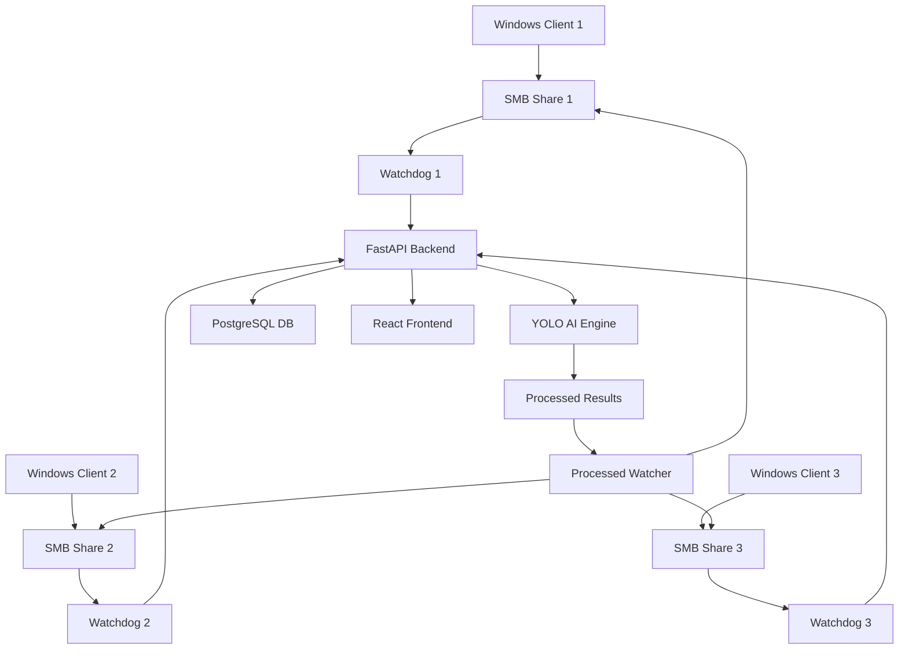

# 🌟 Saatvik EL Detection System
## AI-Powered Solar Panel Defect Detection & Analysis Platform


---

## 📋 Table of Contents
- [System Overview](#-system-overview)
- [Quick Start Guide](#-quick-start-guide)
- [Architecture](#️-architecture)
- [Installation & Setup](#-installation--setup)
- [Configuration Management](#-configuration-management)
- [Running Multiple Machines](#-running-multiple-machines)
- [Maintenance & Operations](#-maintenance--operations)
- [Troubleshooting Guide](#-troubleshooting-guide)
- [Command Reference](#-command-reference)

---

## 🎯 System Overview

Saatvik EL Detection System is a comprehensive AI-powered platform for solar panel defect detection that provides:

### Core Capabilities
- **🤖 AI Detection**: YOLO-based defect detection with grid cell mapping
- **📐 Grid Analysis**: 6×24 solar panel grid with precise defect localization  
- **🏭 Multi-Machine**: Support for multiple production lines simultaneously
- **🕐 Shift Management**: Automatic shift-based folder monitoring
- **📊 Real-time Analytics**: Live dashboard with comprehensive reporting
- **📱 Responsive UI**: Modern React frontend with fullscreen image viewer

### Key Features
```yaml
Detection Engine:
  - YOLO AI model with confidence thresholding
  - Grid cell mapping (A1-F24 coordinates)
  - Real-time file monitoring via SMB network shares
  - Automatic result notification to Windows clients

Multi-Environment Support:
  - Development (dev): Testing & validation
  - Staging (staging): Pre-production validation  
  - Production (prod): Live operations

Machine Management:
  - Test Machine: IT Office with custom shift times
  - Factory Line 1: X/Y shift naming (7AM-7PM)
  - Factory Line 2: Morning/Night shifts (7AM-7PM)
```

---

## 🚀 Quick Start Guide

### Prerequisites Checklist
```bash
# Required Software
✅ Docker & Docker Compose
✅ Python 3.10+
✅ uv (Python package manager)
✅ Node.js 18+ (for frontend development)
✅ SMB network shares mounted
```

### 1-Minute Setup
```bash
# Clone and setup
git clone <repository>
cd saatvik-el-detection

# Generate configuration
python3 setup_config_json.py

# Start system (choose one)
make dev           # Development with hot reload
make up-stage      # Staging environment
make up-prod       # Production environment

# Monitor logs
make logs          # View all logs
```

### Quick Command Reference
```bash
# Essential Commands
make help          # Show all available commands
make status        # Check container status
make health        # System health check

# Development
make dev           # Start development (backend + frontend)
make dev-backend   # Backend only (API + DB)
make restart-dev   # Restart development

# Production
make up-prod       # Start production
make logs-prod     # View production logs
make clean         # Clean all containers
```

---

## 🏗️ Architecture

### High-Level Architecture


### Component Breakdown
```yaml
Backend Services:
  FastAPI Application:
    - Port: 8000 (dev), 8001 (staging), 8002 (prod)
    - API: /api/v1/*
    - Static Files: React build + processed images
    
  PostgreSQL Database:
    - Port: 5432 (dev), 5433 (staging), 5434 (prod)
    - Auto-migrations with SQLModel
    - Environment-specific databases

  YOLO AI Engine:
    - Model: best_6.pt (trained on solar panel defects)
    - Grid mapping: 6×24 cell coordinates
    - Confidence thresholding: 0.2 (dev), 0.3 (staging), 0.5 (prod)

File Watchers:
  EL Watcher:
    - Monitors: SMB source paths for new images
    - Triggers: AI detection pipeline
    - Supports: Multiple machines simultaneously
    
  Processed Watcher:
    - Monitors: Local processed folder for AI results
    - Actions: Copy to SMB + notify Windows clients
    - Updates: Database status to 'saved'

Frontend:
  React Application:
    - Live image viewer with auto-refresh
    - Dashboard with analytics and grid visualization
    - Detection history with advanced filtering
    - Responsive design with fullscreen support
```

### Network Architecture
```
┌─────────────────────────────────────────────────────────────┐
│                     Factory Network                         │
├─────────────────────────────────────────────────────────────┤
│                                                             │
│  Windows Machine 1    Windows Machine 2    Windows Machine 3│
│  (10.10.1.193)       (10.10.1.194)       (10.10.2.1)     │
│  Factory Line 1      Factory Line 2      Test Machine      │
│         │                    │                    │         │
│         ▼                    ▼                    ▼         │
│  /mnt/shared3         /mnt/shared2         /mnt/shared      │
│                                                             │
├─────────────────────────────────────────────────────────────┤
│                Linux Detection Server                       │
│         (SMB mounts + Docker containers)                    │
│                                                             │
│  ┌─────────────┐ ┌─────────────┐ ┌─────────────┐           │
│  │ Watchdog 1  │ │ Watchdog 2  │ │ Watchdog 3  │           │
│  │ (Line 1)    │ │ (Line 2)    │ │ (Test)      │           │
│  └─────────────┘ └─────────────┘ └─────────────┘           │
│         │                │                │                 │
│         └────────────────┼────────────────┘                 │
│                          ▼                                  │
│              ┌─────────────────────┐                        │
│              │   FastAPI Backend   │                        │
│              │   + YOLO AI Engine  │                        │
│              │   + PostgreSQL DB   │                        │
│              │   + React Frontend  │                        │
│              └─────────────────────┘                        │
└─────────────────────────────────────────────────────────────┘
```

---

## 🛠 Installation & Setup

### Step 1: System Preparation
```bash
# Install Docker & Docker Compose
curl -fsSL https://get.docker.com -o get-docker.sh
sh get-docker.sh
sudo usermod -aG docker $USER

# Install uv (Python package manager)
curl -LsSf https://astral.sh/uv/install.sh | sh
source ~/.bashrc

# Install Node.js (for frontend development)
curl -fsSL https://deb.nodesource.com/setup_18.x | sudo -E bash -
sudo apt-get install -y nodejs
```

### Step 2: Project Setup
```bash
# Clone repository
cd /home/administrator/Documents/defect_detection/
git clone <repository> saatvik-el-detection
cd saatvik-el-detection

# Set permissions
sudo chown -R administrator:administrator .
chmod +x *.py Makefile

# Verify directory structure
ls -la
# Should show: app/ frontend/ watchdog/ models/ Makefile setup_config_json.py auto_updater.py
```

### Step 3: Configuration Generation
```bash
# Generate initial configuration
python3 setup_config_json.py

# Verify configuration
cat shared_config.json | jq .

# Expected output: JSON with 3 machines in dev/staging/prod modes
```

### Step 4: SMB Mount Setup
```bash
# Create mount points
sudo mkdir -p /mnt/shared /mnt/shared2 /mnt/shared3

# Example SMB mounting (adjust for your network)
sudo mount -t cifs //10.10.1.193/shared /mnt/shared3 -o username=admin,password=pass
sudo mount -t cifs //10.10.1.194/shared /mnt/shared2 -o username=admin,password=pass
sudo mount -t cifs //10.10.2.1/shared /mnt/shared -o username=admin,password=pass

# Make permanent (add to /etc/fstab)
echo '//10.10.1.193/shared /mnt/shared3 cifs username=admin,password=pass 0 0' | sudo tee -a /etc/fstab
```

### Step 5: Start Services
```bash
# Start development environment
make dev

# OR start specific environment
make up-stage    # Staging on port 8001
make up-prod     # Production on port 8002

# Verify services
make status
make health
```

---

## ⚙️ Configuration Management

### Configuration File Structure
```json
{
  "current_mode": "dev",
  "current_machine": "Factory Line 2",
  "modes": {
    "dev": {
      "database_name": "saatvik_el_db_dev",
      "api_base": "http://localhost:8000",
      "confidence_threshold": 0.2,
      "machines": {
        "Test Machine": {
          "machine_id": "IT Office Machine",
          "smb_source_path": "/mnt/shared",
          "smb_watch_path": "/mnt/shared/2025-06-27/Morning Shift",
          "smb_processed_path": "/mnt/shared/processed",
          "client_ip": "10.10.2.1"
        }
      }
    }
  }
}
```

### Machine Configuration
| Parameter | Description | Example |
|-----------|-------------|---------|
| `machine_id` | Unique identifier | "Factory Line 1" |
| `smb_source_path` | Base SMB mount | "/mnt/shared3" |
| `smb_watch_path` | Dynamic path (auto-updated) | "/mnt/shared3/2025-06-27/X" |
| `smb_processed_path` | Output directory | "/mnt/shared1/processed" |
| `client_ip` | Windows client IP | "10.10.1.193" |

### Shift Configuration (Built-in)
```python
# Test Machine: Custom shift times
"Morning Shift": 6:50 AM to 6:50 PM
"Night Shift": 6:50 PM to 6:50 AM

# Factory Line 2: Standard shifts  
"Morning Shift": 7:00 AM to 7:00 PM
"Night Shift": 7:00 PM to 7:00 AM

# Factory Line 1: X/Y naming
"X": 7:00 AM to 7:00 PM
"Y": 7:00 PM to 7:00 AM
```

### Auto-Update System
```bash
# Test auto-updater
python3 auto_updater.py

# Setup automatic path updates
crontab -e
# Add: */10 * * * * cd /path/to/project && python3 auto_updater.py >> cron.log 2>&1

# Monitor auto-updates
tail -f cron.log
```

---

## 🏭 Running Multiple Machines

### Method 1: Manual Terminal Management
```bash
# Terminal 1: Start Backend (ONE instance only)
make dev

# Terminal 2: Machine 1 Watchdog
MACHINE="Factory Line 1" uv run watchdog/el_watcher.py

# Terminal 3: Machine 2 Watchdog  
MACHINE="Factory Line 2" uv run watchdog/el_watcher.py

# Terminal 4: Processed Images Watcher
uv run watchdog/processed_watcher.py

# Terminal 5: Monitor Logs
tail -f logs/*.log
```

### Method 2: One-Script Solution
```bash
# Create and use the one-script solution
cat > start_all_services.sh << 'EOF'
#!/bin/bash
# Saatvik EL Detection - Complete Service Startup

echo "🚀 Starting Saatvik EL Detection System..."

# Start backend
echo "Starting backend services..."
make dev &
sleep 60

# Start machine watchdogs
echo "Starting machine watchdogs..."
MACHINE="Factory Line 1" uv run watchdog/el_watcher.py &
MACHINE="Factory Line 2" uv run watchdog/el_watcher.py &
MACHINE="Test Machine" uv run watchdog/el_watcher.py &

# Start processed watcher
echo "Starting processed watcher..."
uv run watchdog/processed_watcher.py &

echo "✅ All services started!"
echo "🌐 Frontend: http://localhost:8000"
echo "📚 API Docs: http://localhost:8000/docs"

wait
EOF

chmod +x start_all_services.sh
./start_all_services.sh
```

### Method 3: Auto-Startup Service
```bash
# Create systemd service
sudo tee /etc/systemd/system/saatvik-el.service << 'EOF'
[Unit]
Description=Saatvik EL Detection System
After=network.target

[Service]
Type=forking
User=administrator
WorkingDirectory=/home/administrator/Documents/defect_detection/saatvik-el-detection
ExecStart=/home/administrator/Documents/defect_detection/saatvik-el-detection/start_all_services.sh
Restart=always

[Install]
WantedBy=multi-user.target
EOF

# Enable and start service
sudo systemctl enable saatvik-el.service
sudo systemctl start saatvik-el.service
sudo systemctl status saatvik-el.service
```

---

## 🔧 Maintenance & Operations

### Daily Operations
```bash
# Morning Startup Checklist
make status          # Check all containers
make health         # Verify system health
curl http://localhost:8000/api/v1/health  # API health

# Monitor active processes
ps aux | grep -E "(el_watcher|processed_watcher)"

# Check log files
tail -f logs/saatvik_el_dev_*.log
tail -f el_watcher.log
tail -f processed_watcher.log

# Verify SMB mounts
df -h | grep mnt
ls -la /mnt/shared*
```

### Weekly Maintenance
```bash
# Database backup
docker exec saatvik-el-db pg_dump -U postgres saatvik_el_db > backup_$(date +%Y%m%d).sql

# Log rotation and cleanup
find logs/ -name "*.log" -mtime +7 -delete
find processed/ -name "*" -mtime +30 -delete

# Update system
git pull origin main
make down && make dev

# Performance monitoring
docker stats
free -h
df -h
```

### Monthly Tasks
```bash
# Full system backup
tar -czf saatvik_backup_$(date +%Y%m%d).tar.gz \
  shared_config.json processed/ logs/ models/

# Database optimization
docker exec saatvik-el-db psql -U postgres -d saatvik_el_db -c "VACUUM FULL;"

# Update dependencies
uv pip install --upgrade -r pyproject.toml
cd frontend && npm update

# Security review
docker images | grep -v "latest" | awk '{print $1":"$2}' | xargs docker rmi
```

### Environment Management
```bash
# Switch between environments
make down              # Stop current
make up-stage         # Start staging
make up-prod          # Start production

# Environment-specific operations
make logs-dev         # Development logs
make logs-stage       # Staging logs  
make logs-prod        # Production logs

# Database management per environment
docker exec saatvik-el-db-stage psql -U postgres -d saatvik_el_db_staging
docker exec saatvik-el-db-prod psql -U postgres -d saatvik_el_db_prod
```

---

## 🔍 Troubleshooting Guide

### 🚨 Common Issues & Solutions

#### Issue: Services Won't Start
```bash
# Diagnosis
make status
docker ps -a
docker logs saatvik-el-api

# Solutions
make clean              # Clean everything
make build-dev         # Rebuild containers
make dev               # Start fresh

# If database issues
docker volume rm saatvik-el-detection_postgres_data
make dev
```

#### Issue: Watchdog Not Detecting Files
```bash
# Check SMB mounts
df -h | grep mnt
ls -la /mnt/shared*

# Verify paths in config
cat shared_config.json | jq '.modes.dev.machines'

# Test watchdog manually
MACHINE="Factory Line 1" python3 watchdog/el_watcher.py

# Check permissions
sudo chown -R administrator:administrator /mnt/shared*
chmod -R 755 /mnt/shared*
```

#### Issue: Frontend Not Loading
```bash
# Check API status
curl http://localhost:8000/api/v1/health

# Rebuild frontend
cd frontend
npm install
npm run build
cd ..
make restart-dev

# Check static files
ls -la app/static/
```

#### Issue: Database Connection Failed
```bash
# Check database container
docker logs saatvik-el-db

# Reset database
make down
docker volume rm saatvik-el-detection_postgres_data
make dev

# Manual connection test
docker exec -it saatvik-el-db psql -U postgres -d saatvik_el_db
```

#### Issue: AI Model Not Loading
```bash
# Check model file
ls -la models/best_6.pt

# Check logs for YOLO errors
docker logs saatvik-el-api | grep -i yolo

# Test model manually
python3 -c "
from ultralytics import YOLO
model = YOLO('models/best_6.pt')
print('Model loaded successfully')
"
```

### 📊 Health Check Commands
```bash
# Complete system health check
./health_check.sh

# Individual component checks
curl http://localhost:8000/api/v1/health/detailed
docker exec saatvik-el-db pg_isready -U postgres
ps aux | grep -E "(el_watcher|processed_watcher)"

# Network connectivity
ping 10.10.1.193    # Factory Line 1
ping 10.10.1.194    # Factory Line 2  
ping 10.10.2.1      # Test Machine
```

### 🔄 Recovery Procedures

#### Full System Recovery
```bash
# Step 1: Stop everything
make clean
docker system prune -af

# Step 2: Backup critical data
cp shared_config.json shared_config.json.backup
tar -czf recovery_backup.tar.gz processed/ logs/ models/

# Step 3: Fresh installation
git pull origin main
python3 setup_config_json.py
make dev

# Step 4: Restore and verify
make status
make health
curl http://localhost:8000/api/v1/health
```

#### Configuration Recovery
```bash
# If config is corrupted
cp shared_config.json.backup shared_config.json

# OR regenerate from scratch
python3 setup_config_json.py

# Verify configuration
python3 -c "
import json
with open('shared_config.json') as f:
    config = json.load(f)
    print('Config validation: OK')
    print(f'Machines: {list(config[\"modes\"][\"dev\"][\"machines\"].keys())}')
"
```

---

## 📖 Command Reference

### 🐳 Docker Commands
```bash
# Container Management
make up              # Start development
make down            # Stop development  
make restart         # Restart development
make logs            # View logs
make build           # Build containers
make clean           # Clean everything

# Environment-Specific
make up-stage        # Start staging (port 8001)
make up-prod         # Start production (port 8002)
make logs-stage      # Staging logs
make logs-prod       # Production logs
make restart-stage   # Restart staging
make restart-prod    # Restart production

# Utility
make status          # Container status
make health          # System health
make help            # Show all commands
```

### 🤖 Watchdog Commands
```bash
# Start Individual Watchdogs
MACHINE="Factory Line 1" uv run watchdog/el_watcher.py
MACHINE="Factory Line 2" uv run watchdog/el_watcher.py  
MACHINE="Test Machine" uv run watchdog/el_watcher.py
uv run watchdog/processed_watcher.py

# Background Execution
nohup MACHINE="Factory Line 1" uv run watchdog/el_watcher.py > line1.log 2>&1 &
nohup MACHINE="Factory Line 2" uv run watchdog/el_watcher.py > line2.log 2>&1 &
nohup uv run watchdog/processed_watcher.py > processed.log 2>&1 &

# Process Management
pkill -f el_watcher.py
pkill -f processed_watcher.py
ps aux | grep -E "(el_watcher|processed_watcher)"
```

### ⚙️ Configuration Commands
```bash
# Configuration Management
python3 setup_config_json.py        # Generate initial config
python3 auto_updater.py             # Update paths based on shifts
cat shared_config.json | jq .       # View current config

# Validation
python3 -c "
import json
with open('shared_config.json') as f:
    config = json.load(f)
    print('✅ Configuration is valid')
"

# Backup & Restore
cp shared_config.json config_backup_$(date +%Y%m%d).json
cp config_backup_20250627.json shared_config.json
```

### 🗄️ Database Commands
```bash
# Database Operations
docker exec saatvik-el-db psql -U postgres -d saatvik_el_db
docker exec saatvik-el-db pg_dump -U postgres saatvik_el_db > backup.sql
docker exec -i saatvik-el-db psql -U postgres -d saatvik_el_db < backup.sql

# Queries
docker exec saatvik-el-db psql -U postgres -d saatvik_el_db -c "
SELECT machine_name, COUNT(*), AVG(total_defects) 
FROM detection_records 
GROUP BY machine_name;
"

# Maintenance
docker exec saatvik-el-db psql -U postgres -d saatvik_el_db -c "VACUUM FULL;"
docker exec saatvik-el-db psql -U postgres -d saatvik_el_db -c "ANALYZE;"
```

### 🌐 API Commands
```bash
# Health Checks
curl http://localhost:8000/api/v1/health
curl http://localhost:8000/api/v1/health/detailed
curl http://localhost:8001/api/v1/health  # Staging
curl http://localhost:8002/api/v1/health  # Production

# Detection Queries
curl "http://localhost:8000/api/v1/detect/recent?limit=10"
curl "http://localhost:8000/api/v1/detect/machines"
curl "http://localhost:8000/api/v1/analytics/dashboard"

# File Upload Test
curl -X POST "http://localhost:8000/api/v1/detect/detect-defect" \
  -F "file=@test_image.jpg" \
  -F "confidence=0.5"
```

### 📁 File System Commands
```bash
# SMB Management
sudo mount -t cifs //server/share /mnt/shared -o username=user,password=pass
sudo umount /mnt/shared
df -h | grep mnt
ls -la /mnt/shared*

# Permissions
sudo chown -R administrator:administrator /mnt/shared*
chmod -R 755 /mnt/shared*
sudo chmod +x *.py Makefile

# Cleanup
find processed/ -name "*" -mtime +30 -delete
find logs/ -name "*.log" -mtime +7 -delete
docker system prune -f
```

### 🔧 System Monitoring
```bash
# Resource Usage
docker stats
free -h
df -h
top -p $(pgrep -d, python3)

# Network
netstat -tlnp | grep -E "(8000|8001|8002|5432)"
ss -tulpn | grep -E "(8000|8001|8002)"

# Logs
tail -f logs/*.log
journalctl -u docker -f
dmesg | tail -20
```

---

## 🎯 Access Points

### Web Interfaces
- **🏠 Development**: http://localhost:8000
- **🧪 Staging**: http://localhost:8001  
- **🚀 Production**: http://localhost:8002
- **📚 API Documentation**: http://localhost:8000/docs

### Key Features
- **📺 Live View**: Real-time image monitoring with auto-refresh
- **🏠 Dashboard**: Analytics with grid visualization and machine insights
- **📋 History**: Searchable detection history with filtering
- **🔍 Detail View**: Individual image analysis with grid mapping

### Default Credentials
```yaml
Database:
  Username: postgres
  Password: postgres
  
System:
  User: administrator
  SSH: Standard key-based authentication
```

---

## 📞 Support & Maintenance

### Log Locations
```bash
Application Logs:
  - logs/saatvik_el_dev_*.log
  - el_watcher.log  
  - processed_watcher.log
  - cron.log

Docker Logs:
  - docker logs saatvik-el-api
  - docker logs saatvik-el-db
```

### Configuration Files
```bash
Core Configuration:
  - shared_config.json (main system config)
  - docker-compose.yml (development)
  - docker-compose.staging.yml 
  - docker-compose.prod.yml

Environment Files:
  - .env (development overrides)
  - .env.staging
  - .env.prod
```

### Emergency Contacts
```bash
# System Status Check
make status && make health

# Emergency Restart
make clean && make dev

# Full System Recovery
./recovery_script.sh

# Contact Information
# Add your support contact details here
```

---

## 📈 Performance Optimization

### System Tuning
```bash
# Docker Resource Limits (production)
# Adjust in docker-compose.prod.yml:
deploy:
  resources:
    limits:
      memory: 2G
      cpus: '1.0'

# Database Optimization
docker exec saatvik-el-db psql -U postgres -d saatvik_el_db -c "
ALTER SYSTEM SET shared_buffers = '256MB';
ALTER SYSTEM SET work_mem = '4MB';
SELECT pg_reload_conf();
"
```

### Monitoring Setup
```bash
# Resource monitoring script
cat > monitor.sh << 'EOF'
#!/bin/bash
while true; do
  echo "$(date): CPU: $(top -bn1 | grep "Cpu(s)" | awk '{print $2}') | Memory: $(free -h | awk 'NR==2{print $3"/"$2}') | Disk: $(df -h / | awk 'NR==2{print $5}')"
  sleep 60
done
EOF

chmod +x monitor.sh
./monitor.sh > system_monitor.log &
```

---

*This documentation is maintained for the Saatvik EL Detection System. Last updated: June 2025*